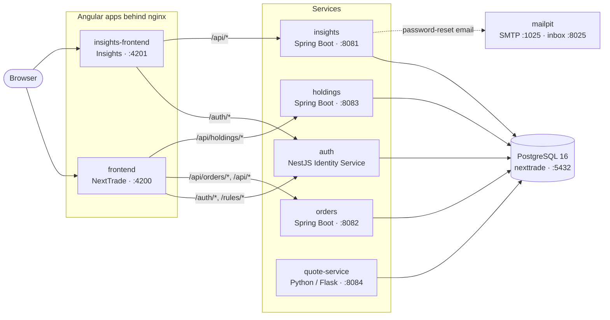
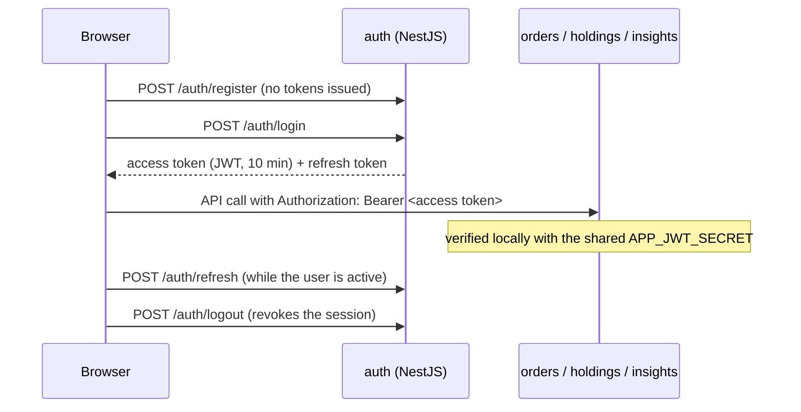

# NextTrade

**Team: Lil Leap**

NextTrade is a trading platform built around two applications: **NextTrade**, the core trading experience, and **NextTrade Insights**, which turns that activity into analytics and reporting. This repository holds the full stack behind both - NextTrade and Insights Spring Boot services, their Angular frontends, a standalone Identity Service, the PostgreSQL schema, a synthetic quote data pipeline, and the Docker/Jenkins automation that ties it all together.

## Team

| Team Member     | Role                              |
| ---------------- | ---------------------------------- |
| Kevin Marin      | Technical Lead                     |
| Lalima Karri     | Developer, Angular (Scrum Master)  |
| Ilhan Gelle      | Developer, Security                |
| Tanush Kaushik   | Developer, Data Engineer           |
| Julia Wiecek     | Developer, Spring Boot             |

## Project Structure

```text
lil-leap/
|- auth/                 # NestJS Identity Service: register, login, refresh/logout,
|                        #   server-assigned trader tier, OpenAPI spec (openapi.json)
|- nextTrade-orders/     # Spring Boot: fill-or-reject order execution engine
|- nextTrade-holdings/   # Spring Boot: holdings service (still the shared starter codebase)
|- insights/             # Spring Boot: portfolio, order submission, instruments,
|                        #   market data, password reset
|- frontend/             # Angular: NextTrade trading app (nginx, :4200)
|- insights-frontend/    # Angular: Insights reporting app (nginx, :4201)
|- data-pipeline/        # Python/Flask quote-service: synthetic quotes -> Postgres
|- db/                   # Schema, migrations, seeds, app-role script, SQL tests, ER diagram
|- docs/                 # architecture/ (ADRs) and stories/
|- InitialSetup/         # Jenkins setup guide
|- docker-compose.yml    # Runs the whole stack locally
|- Jenkinsfile           # CI: compose validation, tests, coverage, image build
|- env.example           # Environment variables to copy into .env
`- RUN_*.md, README_*.md # Run notes for individual tickets
```

## Architecture



Browsers only talk to the two nginx frontends; each proxies API paths to the
right service on the Docker network, so every call is same-origin (no CORS).
`auth` has no host port at all. Every service connects to Postgres as the
restricted `app_user` role; the schema is owned by the admin role.

| Service | Tech | Host port | What it does today |
|---|---|---|---|
| `auth` | NestJS 10 + TypeORM | none (via nginx) | Registration, login, refresh-token rotation and logout; assigns the trader tier; `GET /rules/tier-eligibility`. See [auth/README.md](auth/README.md). |
| `orders` | Spring Boot 3.3.4 | 8082 | Scheduled fill-or-reject execution of due orders. |
| `holdings` | Spring Boot 3.3.4 | 8083 | Placeholder: same starter codebase as `orders`, no holdings logic yet. |
| `insights` | Spring Boot 3.3.4 | 8081 | Client financials/portfolio, order submission, instrument lookup, market data, password reset (email via mailpit). |
| `quote-service` | Python 3.12 + Flask | 8084 | Generates synthetic quotes and ingests them into Postgres continuously. |
| `db` | PostgreSQL 16 | 5432 | Schema from `db/finalized-schema.sql`, role from `db/init-app-role.sh`. |
| `mailpit` | mailpit | 1025, 8025 | Captures outgoing email in development. |

The three Spring Boot services still carry the original monolith's
registration and login endpoints (`/api/v1/users`, `/auth/login`). They're
unreachable from the browser -- nginx sends `/auth/*` to the NestJS service --
and are due to be removed.

### Authentication Flow



The access token carries `sub`, `email`, `client_id` and, for traders,
`trader_level`, which the frontend uses to pick the Novice or Advanced
dashboard. Sessions expire after 10 minutes of inactivity (BR-03).

## Technology Stack

| Layer          | Technology                              | Notes                                          |
| -------------- | ---------------------------------------- | ----------------------------------------------- |
| Backend        | Spring Boot 3.3.4 (Java 17/21)          | REST APIs, validation, service layer            |
| Identity Service | NestJS 10 + TypeORM                   | Standalone auth service, shares the Postgres DB |
| Security       | Spring Security + JJWT / bcryptjs + JWT | Password hashing + Bearer JWT auth              |
| Database       | PostgreSQL 16 + `pgcrypto`              | UUID keys and SSN encryption in DB              |
| Frontend       | Angular 22 + TypeScript                 | Two standalone Angular apps                     |
| Data           | Python 3.12 + Flask + NumPy + Pandas    | Synthetic quote generation pipeline             |
| DevOps         | Docker, Docker Compose, Jenkins         | Container builds and CI automation              |

## Backend API

| Service | Endpoints (as the browser reaches them) |
|---|---|
| `auth` | `POST /auth/register`, `/auth/login`, `/auth/refresh`, `/auth/logout`; `GET /rules/tier-eligibility`; `GET /health`. Full spec: [auth/openapi.json](auth/openapi.json). |
| `insights` | Client financials/portfolio, order submission, instrument lookup, password reset under `/api/*` (Insights app). See [insights/README.md](insights/README.md). |
| `orders` | No business endpoints yet; runs the order execution engine on a schedule. |
| `holdings` | No business endpoints yet. |

The Spring Boot services also still contain the monolith's `POST /api/v1/users`,
`POST /auth/login` and `GET /api/v1/users/me`; see [Architecture](#architecture).

## API Documentation (Swagger / OpenAPI)

- **auth:** [auth/openapi.json](auth/openapi.json) (generated from the code by
  [auth/src/docs/](auth/src/docs/); open it in [editor.swagger.io](https://editor.swagger.io)).
  With the stack running, Swagger UI is at `http://localhost:4200/auth/docs`.

The Spring Boot and Python services don't publish OpenAPI specs yet.

## Database

- Schema: `db/finalized-schema.sql`
- Role/bootstrap script: `db/init-app-role.sh`
- Seed data: `db/seeds/001_us_equity_instruments.sql`
- ER diagram: [`db/ER_Diagram.pdf`](db/ER_Diagram.pdf) / [`db/er_diagram.png`](db/er_diagram.png)

### Credential and Role Model (Current Dev Setup)

- `main` owns the schema and performs privileged setup
- `app_user` is restricted to DML for application runtime use

Current hardcoded development credentials (set in `docker-compose.yml`):

| Principal      | Username   | Password         |
| --------------- | ----------- | ----------------- |
| DB owner/admin  | `main`     | `main_password`   |
| App DB user     | `app_user` | `my_app_password` |

`init-app-role.sh` grants `app_user` connect/schema usage plus table-level
DML permissions. These are development-only credentials — see
[Notes for Production Hardening](#notes-for-production-hardening).

## Docker Compose

`docker-compose.yml` defines nine services:

| Service             | Built from        | Host port(s)                | Notes                                    |
| -------------------- | ------------------ | ----------------------------- | ------------------------------------------ |
| `db`                 | `postgres:16-alpine`| `5432`                        | Runs schema/seed scripts once, on an empty volume; has a `pg_isready` healthcheck |
| `orders`             | `./nextTrade-orders`| `8082` -> `8080`             | Order execution engine; `frontend` proxies `/api/orders/*` and `/api/*` here |
| `holdings`           | `./nextTrade-holdings`| `8083` -> `8080`           | Holdings service (starter code only); `frontend` proxies `/api/holdings/*` here |
| `insights`           | `./insights`       | `8081` -> `8080`              | Reporting service (see [Architecture](#architecture)) |
| `auth`               | `./auth`           | none (`3000` internal)        | Identity Service; reached only via the frontends' nginx (`/auth/*`, `/rules/*`) |
| `frontend`           | `./frontend`       | `4200` -> `80`                | nginx: serves the NextTrade app, proxies to `auth`, `orders`, `holdings` |
| `insights-frontend`  | `./insights-frontend` | `4201` -> `80`              | nginx: serves the Insights app, proxies to `auth`, `insights` |
| `quote-service`      | `./data-pipeline`  | `${QUOTE_SERVICE_PORT:-8084}` -> `8080` | Waits for `db`'s healthcheck before starting |
| `mailpit`            | `axllent/mailpit`  | `1025` (SMTP), `8025` (web UI)| Captures password-reset emails in dev    |

Important runtime behavior:

- Services reach Postgres internally at `db:5432`; `orders`, `holdings`,
  `insights`, `auth`, and `quote-service` all connect over the Docker network.
- DB initialization scripts (`db/finalized-schema.sql`, `db/init-app-role.sh`,
  the seed file) only run on the **first** startup of an empty `db_data`
  volume — re-run them by clearing that volume (`docker compose down -v`).
- `quote-service` waits for `db`'s healthcheck to pass before starting; the
  other services only wait for `db` to start, not for it to be ready.

## Jenkins Pipeline (CI)

`Jenkinsfile` stages, in order:

1. **Checkout**
2. **Detect Compose Command** - picks `docker-compose` or `docker compose`, whichever is available on the agent
3. **Validate Compose YAML** - `compose config -q` and `compose config`, using synthetic `TLS_KEYSTORE_PASSWORD`, `TLS_KEYSTORE_PATH`, `AUTH_SERVICE_TLS_KEYSTORE_PATH`, and `APP_JWT_SECRET` values scoped only to this stage
4. **Unit Tests - nextTrade-orders** - `mvn clean verify` in `nextTrade-orders/`
5. **Unit Tests - nextTrade-holdings** - `mvn clean verify` in `nextTrade-holdings/`
6. **Unit Tests - insights-service** - `mvn clean verify` against `insights/pom.xml`
7. **Publish Coverage - nextTrade-orders** - archives the JaCoCo report from `nextTrade-orders/target/site/jacoco/`
8. **Publish Coverage - nextTrade-holdings** - archives the JaCoCo report from `nextTrade-holdings/target/site/jacoco/`
9. **Run Python Tests With Coverage** - runs `pytest` with coverage for `data-pipeline/` inside a `python:3.12-slim` container
10. **Archive Python Coverage** - archives `data-pipeline/htmlcov/` and `coverage.xml`
11. **Build Compose Services** - `docker compose build`

Notes:

- The Jenkins agent needs a local Docker daemon with Compose, permission to
  run Docker, and the `maven` and `JDK21` tools configured. No host Maven or
  Node install is required.
- Compose validation never prints the fully-resolved config, since that
  would include the database and TLS passwords; only `config -q` runs, and
  only with placeholder secrets scoped to that stage.
- There is currently no frontend (Angular) test or build stage in CI.
- Concurrent runs of this job are disabled (`disableConcurrentBuilds()`).

## Local Development

### Prerequisites

| Tool           | Recommended Version         |
| --------------- | ----------------------------- |
| Java            | 21                            |
| Maven           | 3.9+                          |
| Node.js         | 24.x                          |
| npm             | 10+                           |
| Python          | 3.12                          |
| Docker          | Latest                        |
| Docker Compose  | v2+                           |

### 1) Start the Database

```bat
docker compose up -d db
```

### 2) Run a Trading Service (nextTrade-orders or nextTrade-holdings) Locally

Configure the database environment using [env.example](env.example) (copy
it to `.env` and set real values). For a service running outside Docker,
set `DB_HOST=localhost`.

```bat
cd nextTrade-orders
mvn clean test
mvn spring-boot:run
```

Swap `nextTrade-orders` for `nextTrade-holdings` to run the other service —
they're identical today, so either one works. Both default to
`http://localhost:8080` when run this way, so **don't run them side by side
outside Docker** without overriding `server.port` on one of them; Docker
Compose keeps them apart on host ports `8082` and `8083`.

### 3) Run the Identity Service (auth) Locally

```bat
cd auth
npm ci
npm run start:dev
```

See [auth/README.md](auth/README.md#environment-variables) for the required
environment variables.

### 4) Run a Frontend Locally

```powershell
cd frontend
npm ci
npm start
```

Open **http://localhost:4200**. On later runs, `npm start` from `frontend`
is enough unless dependencies have changed. See the
[frontend guide](frontend/README.md) for troubleshooting. Swap `frontend`
for `insights-frontend` (served on port `4201`) to run the reporting UI
instead.

### 5) Run the Full Stack via Compose

```bat
docker compose build
docker compose up -d
```

Stop and clean up (including the DB volume):

```bat
docker compose down -v
```

## Testing

### nextTrade-orders / nextTrade-holdings (JUnit + Spring Boot Test + MockMvc)

```bat
cd nextTrade-orders
mvn clean test
```

Same command from `nextTrade-holdings` runs its (currently identical) test suite.

### insights

```bat
cd insights
mvn test
```

### auth (Jest)

```bat
cd auth
npm test
```

### Frontend build validation

```bat
cd frontend
npm test

cd insights-frontend
npm test
```

### Data Pipeline (Pytest)

```bat
cd data-pipeline
python -m pip install -r requirements.txt
pytest
```

### Code Coverage

| Service              | Generate                                  | Report                                              |
| --------------------- | ------------------------------------------ | ----------------------------------------------------- |
| `nextTrade-orders`    | `cd nextTrade-orders && mvn clean verify` | `nextTrade-orders/target/site/jacoco/index.html`    |
| `nextTrade-holdings`  | `cd nextTrade-holdings && mvn clean verify` | `nextTrade-holdings/target/site/jacoco/index.html` |
| `insights`            | see [insights/JACOCO_COVERAGE.md](insights/JACOCO_COVERAGE.md) | `insights/target/site/jacoco/index.html` |
| `auth`                | see [auth/README.md → Code coverage](auth/README.md#code-coverage) | `auth/coverage/lcov-report/index.html` |
| `data-pipeline`       | see [data-pipeline/PYTEST_COVERAGE.md](data-pipeline/PYTEST_COVERAGE.md) | `data-pipeline/htmlcov/index.html` |

**auth:** 90.2% lines, 79.7% branches (88 unit tests, 24 Sep 2026). Figures and how to
open the report: [auth/README.md → Code coverage](auth/README.md#code-coverage).

JaCoCo's `report` goal is bound to Maven's `verify` phase, not `test` — plain
`mvn clean test` (as used elsewhere in this README for quick feedback) does
not produce a coverage report; use `mvn clean verify` when you need one.
Jenkins archives the `nextTrade-orders` and `nextTrade-holdings` JaCoCo
reports and the `data-pipeline` coverage output as build artifacts (see
[Jenkins Pipeline (CI)](#jenkins-pipeline-ci)); `insights` and `auth`
coverage are local-only today.

## JavaDocs

Generated HTML docs are not committed to this repository. Generate them locally:

```bat
cd nextTrade-orders
mvn javadoc:javadoc
```

Then open `nextTrade-orders/target/site/apidocs/index.html` (same command
from `nextTrade-holdings` generates that service's docs).

## Data Pipeline

`data-pipeline/` generates reproducible synthetic US-equity quotes for
offline/dev use and can run as a continuous ingestion service
(`quote-service` in Docker Compose).

Key files:

- `data-pipeline/src/generate_quotes.py`
- `data-pipeline/src/quote_provider.py`
- `data-pipeline/src/service_runner.py`
- `data-pipeline/src/app.py`
- `data-pipeline/tests/`

## Notes for Production Hardening

- Replace hardcoded development DB credentials (`docker-compose.yml`,
  `db/init-app-role.sh`) with secrets or environment variables.
- Set a strong JWT secret via `APP_JWT_SECRET` (the in-code default, and the
  value hardcoded in `docker-compose.yml`, are dev-only).
- Actually split `nextTrade-orders` and `nextTrade-holdings` apart — they're
  identical services today and both still own the full onboarding/auth
  surface; trim each down to its namesake responsibility.
- Add a CI stage for frontend tests and a deploy stage that binds a real TLS
  keystore from Jenkins credentials, per the placeholders already wired into
  the Compose validation stage.
