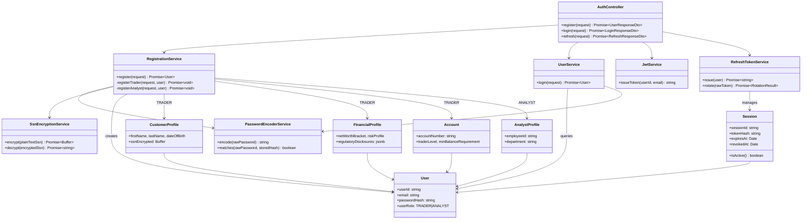
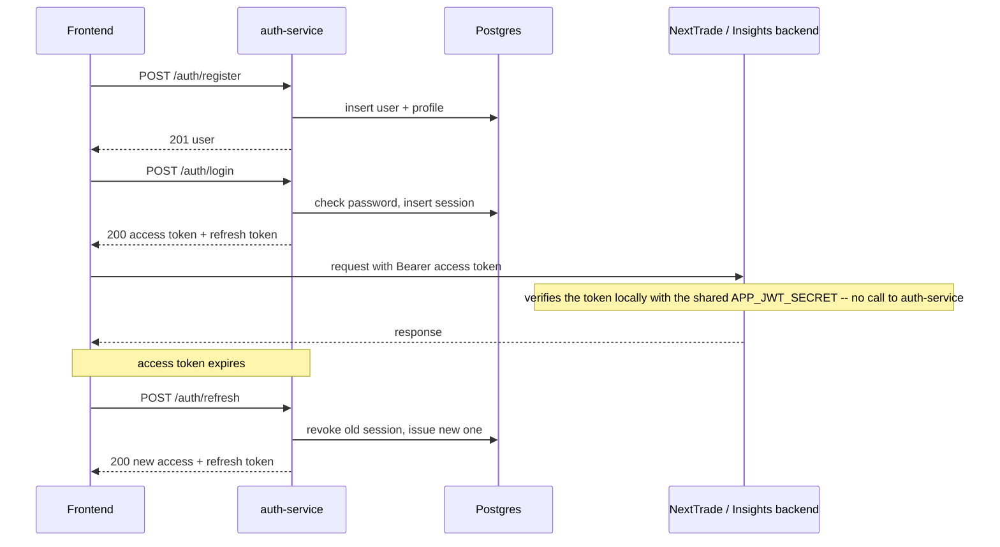

# Identity Service (auth-service)

NextTrade's standalone authentication service: registration, login, and
refresh-token rotation for TRADER and ANALYST accounts.

## Status

Type-checks clean, unit tests passing (`npm test`) covering JWT issuance,
password hashing, health, and the controller's happy/error paths.

## Class diagram



## Flow



Tokens carry the claim shape (`sub`, `email`, `client_id`, HS256) NextTrade
backend and Insights backend already verify locally in their own request
filters — this service only issues tokens, it doesn't verify them.

## Endpoints

| Method | Path             | Auth required | Notes                                 |
|--------|------------------|----------------|-----------------------------------------|
| POST   | `/auth/register` | none           | Creates the account, no tokens issued   |
| POST   | `/auth/login`    | none           | Returns access + refresh tokens         |
| POST   | `/auth/refresh`  | refresh token  | Rotates the refresh token on every use  |
| GET    | `/health`        | none           | Unprefixed, no DB dependency            |

## Design notes

- **Database**: shares the `nexttrade` database's `users`, `sessions`,
  `customer_profiles`, `financial_profiles`, `accounts`, and
  `analyst_profiles` tables. `synchronize: false` always — this service never
  creates or alters schema.
- **Password hashes**: written with a `{bcrypt}` id prefix
  (`PasswordEncoderService`), matching NextTrade backend, so a hash from
  either service verifies on both.
- **Refresh tokens**: opaque random values, SHA-256-hashed before storage.
  Reuse of an already-rotated token is treated as a compromise signal.
- **SSN encryption**: done in Postgres via pgcrypto
  (`pgp_sym_encrypt`/`pgp_sym_decrypt`) — plaintext never touches application
  memory or logs.
- **Errors**: fixed codes and generic messages (`USER_ALREADY_EXISTS`,
  `INVALID_CREDENTIALS`, `INVALID_REFRESH_TOKEN`, `INVALID_REQUEST`,
  `INTERNAL_ERROR`) — request payloads can carry passwords/SSNs, so raw
  messages are never echoed back.
- **Transport**: HTTPS-only, direct PKCS12 keystore, `X-Forwarded-*` ignored,
  standard security headers (HSTS/CSP/frame-deny/no-referrer/permissions-policy).
- **No CORS**: this service has no `ports:` mapping in `docker-compose.yml`
  — only reachable container-to-container, never by a browser. Add
  `enableCors()` scoped to specific origins only if a frontend ever calls it
  directly.

## Environment variables

See `.env.example`: `DB_HOST`, `DB_PORT`, `DB_NAME`, `DB_APP_USERNAME`,
`DB_APP_PASSWORD`, `APP_JWT_SECRET`, `APP_JWT_EXPIRATION_MINUTES`,
`APP_JWT_CLIENT_ID`, `APP_REFRESH_EXPIRATION_DAYS`,
`NEXTTRADE_SECURITY_SSN_ENCRYPTION_KEY`, `TLS_KEYSTORE`,
`TLS_KEYSTORE_PASSWORD`, `PORT` (defaults to 3000).

## Running it

```
npm install
```

| Purpose               | Command             |
|-----------------------|----------------------|
| Watch mode            | `npm run start:dev` — requires a reachable Postgres + a valid `TLS_KEYSTORE` |
| Production build      | `npm run build`      |
| Run built output      | `npm run start:prod` |
| Unit tests            | `npm test` — no DB required |
| Unit tests (watch)    | `npm run test:watch` |
| Coverage report       | `npm run test:cov`   |
