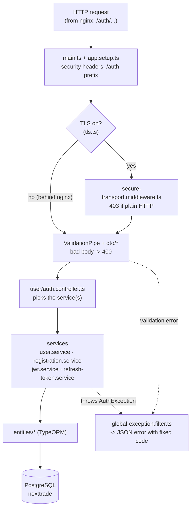
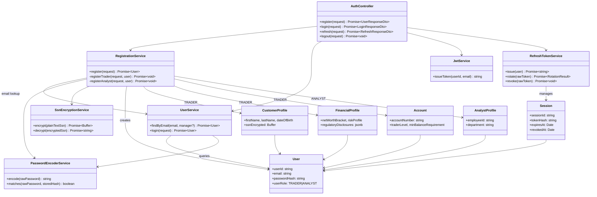
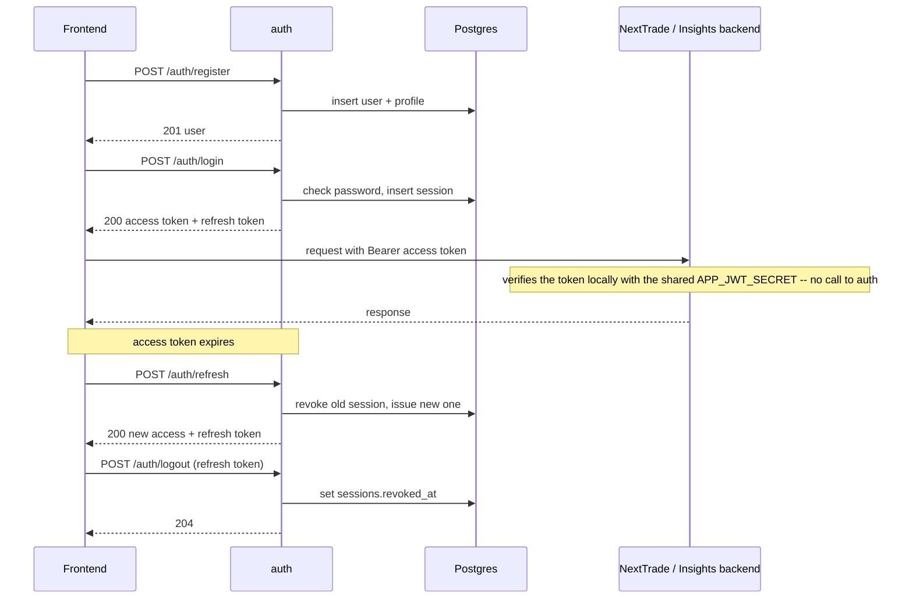

# Identity Service (auth)

NextTrade's standalone authentication service: registration, login,
refresh-token rotation, and logout for TRADER and ANALYST accounts.

## Status

Type-checks clean. Unit tests (`npm test`) cover JWT issuance, password
hashing, refresh-token rotation/revocation, error mapping, health, and the
controller. End-to-end tests (`npm run test:e2e`) run the full
register -> login -> refresh -> logout flow over HTTPS against a real Postgres.

## Project structure

```
auth/
├── src/
│   ├── main.ts                     Starts the app: HTTPS if TLS_KEYSTORE is set, else plain HTTP (behind nginx)
│   ├── app.setup.ts                configureApp(): /auth prefix, security headers, validation, error filter
│   ├── app.module.ts               Wires everything: DB connection, entities, controllers, services, HTTPS check
│   │
│   ├── user/                       The HTTP API and login
│   │   ├── auth.controller.ts      POST /auth/register · /login · /refresh · /logout
│   │   ├── user.service.ts         findByEmail() (case-insensitive) and login() (password check)
│   │   ├── user-role.enum.ts       TRADER | ANALYST
│   │   ├── entities/
│   │   │   └── user.entity.ts      `users` table: email, password hash, role
│   │   ├── dto/                    Request/response shapes, validated by ValidationPipe
│   │   │   ├── register-request.dto.ts   snake_case fields + per-role required-field rules
│   │   │   ├── login-request.dto.ts      { email, password }
│   │   │   ├── login-response.dto.ts     { accessToken, refreshToken, user }
│   │   │   ├── refresh-request.dto.ts    { refreshToken } -- used by /refresh and /logout
│   │   │   ├── refresh-response.dto.ts   { accessToken, refreshToken }
│   │   │   └── user-response.dto.ts      public user: id, email, userRole, timestamps
│   │   └── exceptions/             Expected failures, each with its HTTP status + error code
│   │       ├── auth.exception.ts                  base class
│   │       ├── invalid-credentials.exception.ts   401 INVALID_CREDENTIALS
│   │       ├── invalid-refresh-token.exception.ts 401 INVALID_REFRESH_TOKEN
│   │       └── user-already-exists.exception.ts   409 USER_ALREADY_EXISTS
│   │
│   ├── onboarding/                 Registration
│   │   ├── registration.service.ts One transaction: user row + role-specific rows
│   │   ├── entities/               One per table; each links to its `users` row
│   │   │   ├── customer-profile.entity.ts   `customer_profiles`: name, DOB, phone, address, encrypted SSN (TRADER)
│   │   │   ├── financial-profile.entity.ts  `financial_profiles`: employment, income, net worth, risk, disclosures (TRADER)
│   │   │   ├── account.entity.ts            `accounts`: account number, type, trader level, minimum balance (TRADER)
│   │   │   └── analyst-profile.entity.ts    `analyst_profiles`: employee ID, department (ANALYST)
│   │   └── enums/                  Allowed values; match the schema's CHECK constraints
│   │       ├── account-type.enum.ts         INDIVIDUAL_CASH
│   │       ├── citizenship-status.enum.ts   CITIZEN | PERMANENT_RESIDENT | OTHER
│   │       ├── employment-status.enum.ts    EMPLOYED | SELF_EMPLOYED | RETIRED | STUDENT | UNEMPLOYED
│   │       ├── net-worth-bracket.enum.ts    $0-5k … $500k+
│   │       ├── risk-profile.enum.ts         CONSERVATIVE | MODERATE | AGGRESSIVE
│   │       └── trader-level.enum.ts         NOVICE ($5k min) | ADVANCED ($100k min)
│   │
│   ├── security/                   Tokens, sessions, crypto, transport
│   │   ├── jwt.service.ts          Signs access tokens (HS256, APP_JWT_SECRET)
│   │   ├── refresh-token.service.ts issue / rotate / revoke refresh-token sessions
│   │   ├── entities/
│   │   │   └── session.entity.ts   `sessions` table: token hash, issued/expires/revoked times
│   │   ├── password-encoder.service.ts     bcrypt with the {bcrypt} prefix NextTrade also uses
│   │   ├── ssn-encryption.service.ts       SSN encrypt/decrypt inside Postgres (pgcrypto)
│   │   ├── secure-transport.middleware.ts  403 on plain HTTP -- only when TLS is on
│   │   └── tls.ts                  Reads the TLS_KEYSTORE path
│   │
│   ├── common/filters/
│   │   └── global-exception.filter.ts   Turns every error into a JSON response with a fixed code
│   └── health/
│       └── health.controller.ts    GET /health (no DB check)
│
└── test/                           End-to-end suites against a real Postgres
    ├── auth.e2e-spec.ts            register -> login -> refresh -> logout over HTTPS
    ├── behind-nginx.e2e-spec.ts    same service without TLS, as docker-compose runs it
    └── jest-e2e.json
```

Unit tests (`*.spec.ts`) sit next to the file they test.

## How the code fits together

Every request passes through the same layers:



- **Controllers are thin.** `auth.controller.ts` only calls services and builds DTO responses; all rules live in the services.
- **Services own the logic** and use TypeORM repositories for the entities.
- **Entities map one-to-one to tables** in `db/finalized-schema.sql`. This service never creates or changes tables (`synchronize: false`).
- **Errors** are thrown as `AuthException` subclasses. `global-exception.filter.ts` turns them into `{ "error": CODE, "message": ... }` with the right status, and turns anything unexpected into a generic 500, so passwords and SSNs never leak into responses.

### What each endpoint touches

| Endpoint | Files, in call order | Tables |
|---|---|---|
| `POST /auth/register` | `register-request.dto` → `auth.controller.register` → `registration.service.register` → `user.service.findByEmail` (duplicate check), `password-encoder.encode`, `ssn-encryption.encrypt` (TRADER) → `user-response.dto` | INSERT `users` + `customer_profiles`, `financial_profiles`, `accounts` (TRADER) or `analyst_profiles` (ANALYST), all in one transaction |
| `POST /auth/login` | `login-request.dto` → `auth.controller.login` → `user.service.login` (`password-encoder.matches`) → `jwt.service.issueToken` → `refresh-token.service.issue` → `login-response.dto` | SELECT `users`; INSERT `sessions` |
| `POST /auth/refresh` | `refresh-request.dto` → `auth.controller.refresh` → `refresh-token.service.rotate` → `jwt.service.issueToken` → `refresh-response.dto` | UPDATE old `sessions` row (revoke); INSERT new one |
| `POST /auth/logout` | `refresh-request.dto` → `auth.controller.logout` → `refresh-token.service.revoke` | UPDATE `sessions` row (revoke) |
| `GET /health` | `health.controller` | none |

## Class diagram



## Flow



Tokens carry the claim shape (`sub`, `email`, `client_id`, HS256) NextTrade
backend and Insights backend already verify locally in their own request
filters — this service only issues tokens, it doesn't verify them.

## Endpoints

| Method | Path             | Auth required | Notes                                 |
|--------|------------------|----------------|-----------------------------------------|
| POST   | `/auth/register` | none           | Creates the account, no tokens issued   |
| POST   | `/auth/login`    | none           | Returns access + refresh tokens         |
| POST   | `/auth/refresh`  | refresh token  | Rotates the refresh token on every use  |
| POST   | `/auth/logout`   | refresh token  | Revokes that session; always 204 ([details](#logout)) |
| GET    | `/health`        | none           | Unprefixed, no DB dependency            |

## Logout

`POST /auth/logout` ends one signed-in session by revoking its refresh token.

**Request**

```http
POST /auth/logout
Content-Type: application/json

{ "refreshToken": "<the refresh token from /auth/login or /auth/refresh>" }
```

**Responses**

| Case | Status | Body |
|---|---|---|
| Active session | `204 No Content` | none; the session is revoked |
| Token already revoked, expired, or never issued | `204 No Content` | none; nothing changes |
| `refreshToken` missing or not a string | `400` | `{ "error": "INVALID_REQUEST", ... }` |

It returns 204 whether or not the token was valid. The caller is signed out either way, and the response can't be used to test whether a stolen token still works.

**What changes in the database**

A single conditional update on the matching `sessions` row:

```sql
UPDATE sessions SET revoked_at = now(), last_active_at = now()
WHERE token_hash = <sha256 of the token> AND revoked_at IS NULL AND expires_at > now();
```

The token itself is never stored, only its SHA-256 hash, so the lookup is by hash.

**What it does and doesn't do**

- **Only that session ends.** The same user signed in on another device stays signed in.
- **The refresh token stops working immediately.** `/auth/refresh` with it returns `401 INVALID_REFRESH_TOKEN`.
- **The access token (JWT) keeps working until it expires** (`APP_JWT_EXPIRATION_MINUTES`, default 15). The backends check JWTs with the shared secret and never ask this service, so a client should discard its access token on logout.

**Code path**

1. `user/dto/refresh-request.dto.ts` validates the body (the same DTO `/refresh` uses).
2. `user/auth.controller.ts` → `logout()` returns 204 via `@HttpCode(HttpStatus.NO_CONTENT)`.
3. `security/refresh-token.service.ts` → `revoke()` hashes the token and calls `revokeActive()`.
4. `revokeActive()` runs the conditional UPDATE above through the `Session` repository (`security/entities/session.entity.ts`).

`rotate()` (used by `/auth/refresh`) calls the same `revokeActive()`, so refresh and logout follow one revocation rule. Because it's a single UPDATE, two requests using the same token can't both succeed.

**Try it**

```bash
BASE=localhost:4200/auth    # through the frontend's nginx
J='Content-Type: application/json'
RT=$(curl -s -X POST $BASE/login -H "$J" -d '{"email":"you@example.com","password":"..."}' \
     | python3 -c 'import sys,json; print(json.load(sys.stdin)["refreshToken"])')

curl -s -o /dev/null -w "logout: %{http_code}\n" -X POST $BASE/logout  -H "$J" -d "{\"refreshToken\":\"$RT\"}"   # 204
curl -s -w "  <- refresh: %{http_code}\n"        -X POST $BASE/refresh -H "$J" -d "{\"refreshToken\":\"$RT\"}"   # 401
```

## Design notes

- **Database**: shares the `nexttrade` database's `users`, `sessions`,
  `customer_profiles`, `financial_profiles`, `accounts`, and
  `analyst_profiles` tables. `synchronize: false` always — this service never
  creates or alters schema.
- **Password hashes**: written with a `{bcrypt}` id prefix
  (`PasswordEncoderService`), matching NextTrade backend, so a hash from
  either service verifies on both.
- **Refresh tokens**: opaque random values, SHA-256-hashed before storage.
  A refresh token works once: `/auth/refresh` revokes it and issues a new one,
  and a rotated or revoked token is rejected with `401 INVALID_REFRESH_TOKEN`.
  Revocation is a single conditional `UPDATE ... WHERE revoked_at IS NULL AND
  expires_at > now()`, shared by refresh and logout, so two concurrent uses of
  one token can't both succeed.
- **Logout**: revokes only the session behind the given refresh token (other
  devices stay signed in). Returns 204 even for an unknown or already-revoked
  token, so it can't be used to probe token validity. Access tokens already
  issued stay valid until they expire (`APP_JWT_EXPIRATION_MINUTES`, default
  15) because downstream services verify them statelessly — the frontend
  should drop its access token on logout.
- **SSN encryption**: done in Postgres via pgcrypto
  (`pgp_sym_encrypt`/`pgp_sym_decrypt`) — plaintext never touches application
  memory or logs.
- **Errors**: expected failures extend `AuthException`, which carries the
  HTTP status and code; fixed codes and generic messages (`USER_ALREADY_EXISTS`,
  `INVALID_CREDENTIALS`, `INVALID_REFRESH_TOKEN`, `INVALID_REQUEST`,
  `INTERNAL_ERROR`) — request payloads can carry passwords/SSNs, so raw
  messages are never echoed back.
- **Transport**: in docker-compose, TLS terminates at the frontends' nginx,
  which proxies `/auth/` to `http://auth:3000` over the internal network, so
  this service runs plaintext (`TLS_KEYSTORE` unset). Set `TLS_KEYSTORE` to
  have it terminate TLS itself; it then serves HTTPS only and rejects
  plaintext with `403 HTTPS_REQUIRED` (`X-Forwarded-*` ignored). Standard
  security headers (HSTS/CSP/frame-deny/no-referrer/permissions-policy) either way.
- **No CORS**: browsers reach this service only through nginx on the page's
  own origin (`/auth/...`), and it has no `ports:` mapping in
  `docker-compose.yml`. Frontends must call relative `/auth/...` paths; a
  hardcoded `http://auth:3000` or `localhost:3000` URL would be cross-origin.

## Environment variables

See `.env.example`: `DB_HOST`, `DB_PORT`, `DB_NAME`, `DB_APP_USERNAME`,
`DB_APP_PASSWORD`, `APP_JWT_SECRET`, `APP_JWT_EXPIRATION_MINUTES`,
`APP_JWT_CLIENT_ID`, `APP_REFRESH_EXPIRATION_DAYS`,
`NEXTTRADE_SECURITY_SSN_ENCRYPTION_KEY`, `TLS_KEYSTORE`,
`TLS_KEYSTORE_PASSWORD`, `PORT` (defaults to 3000).

## Running it

```
npm install
```

| Purpose               | Command             |
|-----------------------|----------------------|
| Watch mode            | `npm run start:dev` — requires a reachable Postgres; `TLS_KEYSTORE` optional |
| Production build      | `npm run build`      |
| Run built output      | `npm run start:prod` |
| Unit tests            | `npm test` — no DB required |
| Unit tests (watch)    | `npm run test:watch` |
| Coverage report       | `npm run test:cov`, then open `coverage/lcov-report/index.html` in a browser |
| End-to-end tests      | `npm run test:e2e` — see below |

## End-to-end tests

`test/auth.e2e-spec.ts` boots the real `AppModule` over HTTPS;
`test/behind-nginx.e2e-spec.ts` boots it plaintext, as docker-compose runs it.
They need:

- a Postgres with `db/finalized-schema.sql` and `db/init-app-role.sh` applied
  (the `db` service in `docker-compose.yml` does both), and
- a PKCS12 keystore for the HTTPS suite. A throwaway one:
  `openssl req -x509 -newkey rsa:2048 -nodes -keyout key.pem -out cert.pem -days 1 -subj "/CN=localhost"`
  then `openssl pkcs12 -export -inkey key.pem -in cert.pem -out auth.p12 -passout pass:changeit`.

```
DB_HOST=localhost DB_APP_PASSWORD=... APP_JWT_SECRET=... NEXTTRADE_SECURITY_SSN_ENCRYPTION_KEY=... TLS_KEYSTORE=file:./auth.p12 TLS_KEYSTORE_PASSWORD=changeit npm run test:e2e
```

Each run registers uniquely-named users and deletes them (and their sessions
and profiles) afterwards.
