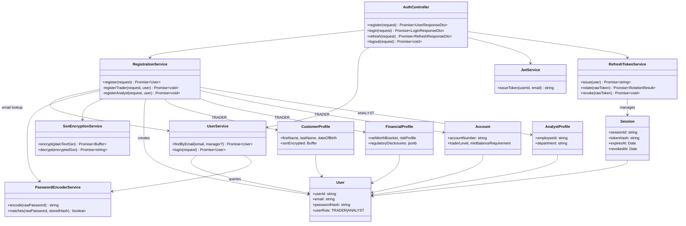
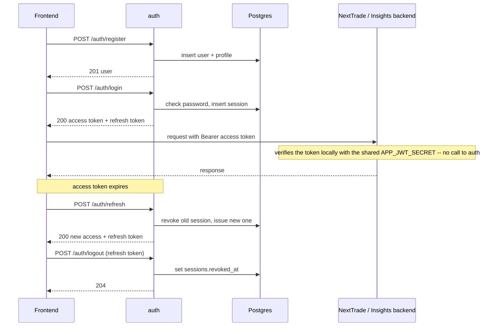

# Identity Service (auth)

NextTrade's standalone authentication service: registration, login,
refresh-token rotation, and logout for TRADER and ANALYST accounts.

## Status

Type-checks clean. Unit tests (`npm test`) cover JWT issuance, password
hashing, refresh-token rotation/revocation, error mapping, health, and the
controller. End-to-end tests (`npm run test:e2e`) run the full
register -> login -> refresh -> logout flow over HTTPS against a real Postgres.

## Class diagram



## Flow



Tokens carry the claim shape (`sub`, `email`, `client_id`, HS256) NextTrade
backend and Insights backend already verify locally in their own request
filters — this service only issues tokens, it doesn't verify them.

## Endpoints

| Method | Path             | Auth required | Notes                                 |
|--------|------------------|----------------|-----------------------------------------|
| POST   | `/auth/register` | none           | Creates the account, no tokens issued   |
| POST   | `/auth/login`    | none           | Returns access + refresh tokens         |
| POST   | `/auth/refresh`  | refresh token  | Rotates the refresh token on every use  |
| POST   | `/auth/logout`   | refresh token  | Revokes that session; always 204        |
| GET    | `/health`        | none           | Unprefixed, no DB dependency            |

## Design notes

- **Database**: shares the `nexttrade` database's `users`, `sessions`,
  `customer_profiles`, `financial_profiles`, `accounts`, and
  `analyst_profiles` tables. `synchronize: false` always — this service never
  creates or alters schema.
- **Password hashes**: written with a `{bcrypt}` id prefix
  (`PasswordEncoderService`), matching NextTrade backend, so a hash from
  either service verifies on both.
- **Refresh tokens**: opaque random values, SHA-256-hashed before storage.
  Reuse of an already-rotated token is treated as a compromise signal.
  Revocation is a single conditional `UPDATE ... WHERE revoked_at IS NULL AND
  expires_at > now()`, shared by refresh and logout, so two concurrent uses of
  one token can't both succeed.
- **Logout**: revokes only the session behind the given refresh token (other
  devices stay signed in). Returns 204 even for an unknown or already-revoked
  token, so it can't be used to probe token validity. Access tokens already
  issued stay valid until they expire (`APP_JWT_EXPIRATION_MINUTES`, default
  15) because downstream services verify them statelessly — the frontend
  should drop its access token on logout.
- **SSN encryption**: done in Postgres via pgcrypto
  (`pgp_sym_encrypt`/`pgp_sym_decrypt`) — plaintext never touches application
  memory or logs.
- **Errors**: expected failures extend `AuthException`, which carries the
  HTTP status and code; fixed codes and generic messages (`USER_ALREADY_EXISTS`,
  `INVALID_CREDENTIALS`, `INVALID_REFRESH_TOKEN`, `INVALID_REQUEST`,
  `INTERNAL_ERROR`) — request payloads can carry passwords/SSNs, so raw
  messages are never echoed back.
- **Transport**: in docker-compose, TLS terminates at the frontends' nginx,
  which proxies `/auth/` to `http://auth:3000` over the internal network, so
  this service runs plaintext (`TLS_KEYSTORE` unset). Set `TLS_KEYSTORE` to
  have it terminate TLS itself; it then serves HTTPS only and rejects
  plaintext with `403 HTTPS_REQUIRED` (`X-Forwarded-*` ignored). Standard
  security headers (HSTS/CSP/frame-deny/no-referrer/permissions-policy) either way.
- **No CORS**: browsers reach this service only through nginx on the page's
  own origin (`/auth/...`), and it has no `ports:` mapping in
  `docker-compose.yml`. Frontends must call relative `/auth/...` paths; a
  hardcoded `http://auth:3000` or `localhost:3000` URL would be cross-origin.

## Environment variables

See `.env.example`: `DB_HOST`, `DB_PORT`, `DB_NAME`, `DB_APP_USERNAME`,
`DB_APP_PASSWORD`, `APP_JWT_SECRET`, `APP_JWT_EXPIRATION_MINUTES`,
`APP_JWT_CLIENT_ID`, `APP_REFRESH_EXPIRATION_DAYS`,
`NEXTTRADE_SECURITY_SSN_ENCRYPTION_KEY`, `TLS_KEYSTORE`,
`TLS_KEYSTORE_PASSWORD`, `PORT` (defaults to 3000).

## Running it

```
npm install
```

| Purpose               | Command             |
|-----------------------|----------------------|
| Watch mode            | `npm run start:dev` — requires a reachable Postgres; `TLS_KEYSTORE` optional |
| Production build      | `npm run build`      |
| Run built output      | `npm run start:prod` |
| Unit tests            | `npm test` — no DB required |
| Unit tests (watch)    | `npm run test:watch` |
| Coverage report       | `npm run test:cov`   |
| End-to-end tests      | `npm run test:e2e` — see below |

## End-to-end tests

`test/auth.e2e-spec.ts` boots the real `AppModule` over HTTPS;
`test/behind-nginx.e2e-spec.ts` boots it plaintext, as docker-compose runs it.
They need:

- a Postgres with `db/finalized-schema.sql` and `db/init-app-role.sh` applied
  (the `db` service in `docker-compose.yml` does both), and
- a PKCS12 keystore for the HTTPS suite. A throwaway one:
  `openssl req -x509 -newkey rsa:2048 -nodes -keyout key.pem -out cert.pem -days 1 -subj "/CN=localhost"`
  then `openssl pkcs12 -export -inkey key.pem -in cert.pem -out auth.p12 -passout pass:changeit`.

```
DB_HOST=localhost DB_APP_PASSWORD=... APP_JWT_SECRET=... NEXTTRADE_SECURITY_SSN_ENCRYPTION_KEY=... TLS_KEYSTORE=file:./auth.p12 TLS_KEYSTORE_PASSWORD=changeit npm run test:e2e
```

Each run registers uniquely-named users and deletes them (and their sessions
and profiles) afterwards.
