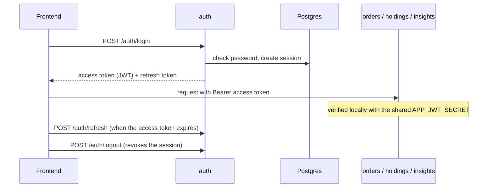

# Identity Service (auth)

NestJS service that registers TRADER and ANALYST accounts, signs users in, and
issues the tokens every NextTrade backend trusts. Sessions can be refreshed and
revoked (logout).

## How it works



- **Access token:** JWT (HS256) with `sub`, `email`, `client_id`; 15 minutes.
  Backends verify it themselves and never call this service.
- **Refresh token:** random value, stored only as a SHA-256 hash in `sessions`;
  30 days, single use (each refresh replaces it).
- Browsers reach the service only through the frontends' nginx at `/auth/*`
  (same origin, so no CORS; no public port in docker-compose).

## Endpoints

| Method | Path | Body | Success | Errors |
|---|---|---|---|---|
| POST | `/auth/register` | role, email, password, profile fields | `201` user (no tokens) | `400`, `409` email exists |
| POST | `/auth/login` | `email`, `password` | `200` tokens + user | `401` |
| POST | `/auth/refresh` | `refreshToken` | `200` new tokens | `401` |
| POST | `/auth/logout` | `refreshToken` | `204` | `400` missing token |
| GET | `/health` | — | `200` | — |

**Logout** revokes only the session behind that refresh token; other devices
stay signed in. It returns `204` even for an unknown or already-revoked token,
so it can't be used to test whether a token is valid. The access token keeps
working until it expires, so clients should discard it on logout.

Errors are JSON with a fixed code (`INVALID_CREDENTIALS`, `USER_ALREADY_EXISTS`,
`INVALID_REFRESH_TOKEN`, `INVALID_REQUEST`, `INTERNAL_ERROR`); raw messages are
never returned, since requests can carry passwords and SSNs.

## Project structure

| Folder | What's in it |
|---|---|
| `src/main.ts`, `app.setup.ts`, `app.module.ts` | Startup: `/auth` prefix, security headers, validation, DB connection |
| `src/user/` | `auth.controller.ts` (the endpoints), `user.service.ts` (login), DTOs, exceptions |
| `src/onboarding/` | `registration.service.ts`: one transaction writing `users` plus the role's profile tables |
| `src/security/` | JWT signing, refresh tokens/sessions, bcrypt, SSN encryption (pgcrypto), optional TLS |
| `src/common/filters/` | Turns every error into a JSON response with a fixed code |
| `test/` | End-to-end suites against a real Postgres |

Entities map one-to-one to tables in `db/finalized-schema.sql`; the service
never creates or changes tables. Unit tests (`*.spec.ts`) sit next to the code.

## Configuration

See `.env.example`. The main settings:

| Variable | Purpose |
|---|---|
| `DB_HOST`, `DB_PORT`, `DB_NAME`, `DB_APP_USERNAME`, `DB_APP_PASSWORD` | Postgres connection (restricted `app_user` role) |
| `APP_JWT_SECRET` | Shared with the backends; required in production, 32+ bytes |
| `APP_JWT_EXPIRATION_MINUTES` / `APP_REFRESH_EXPIRATION_DAYS` | Token lifetimes (15 / 30) |
| `NEXTTRADE_SECURITY_SSN_ENCRYPTION_KEY` | Must match the key the backends use |
| `TLS_KEYSTORE`, `TLS_KEYSTORE_PASSWORD` | Optional: serve HTTPS directly (unset behind nginx) |
| `PORT` | Default 3000 |

## Running it

```
npm install
npm run start:dev      # needs a reachable Postgres
npm run build && npm run start:prod
```

## Testing

| What | Command |
|---|---|
| Unit tests (no database) | `npm test` |
| Code coverage | `npm run test:cov` |
| End-to-end tests | `npm run test:e2e` |

### Code coverage

```
npm run test:cov
```

Open `coverage/lcov-report/index.html` in a browser (Windows:
`start coverage\lcov-report\index.html`). Click a file to see untested lines in
red. The report is generated locally and is not committed.

Unit-test coverage as of September 2026: **68% statements, 66% lines**.
Registration, login and SSN encryption are also covered by the end-to-end
tests, which the report doesn't count.

### End-to-end tests

They boot the real app against a Postgres with `db/finalized-schema.sql` and
`db/init-app-role.sh` applied (the `db` service in `docker-compose.yml` does
both). `auth.e2e-spec.ts` runs over HTTPS and needs a keystore;
`behind-nginx.e2e-spec.ts` runs plain HTTP, as docker-compose does.

```
openssl req -x509 -newkey rsa:2048 -nodes -keyout key.pem -out cert.pem -days 1 -subj "/CN=localhost"
openssl pkcs12 -export -inkey key.pem -in cert.pem -out auth.p12 -passout pass:changeit

DB_HOST=localhost DB_APP_PASSWORD=... APP_JWT_SECRET=... NEXTTRADE_SECURITY_SSN_ENCRYPTION_KEY=... \
TLS_KEYSTORE=file:./auth.p12 TLS_KEYSTORE_PASSWORD=changeit npm run test:e2e
```

Each run creates its own test users and deletes them afterwards.
