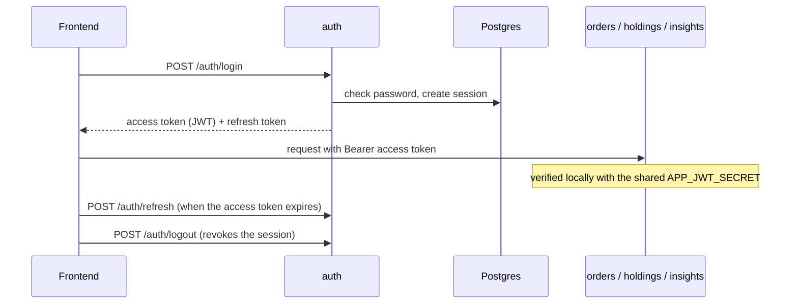

# Identity Service (auth)

NestJS service that registers TRADER and ANALYST accounts, signs users in, and
issues the tokens every NextTrade backend trusts. Sessions can be refreshed and
revoked (logout).

## How it works



- **Access token:** JWT (HS256) with `sub`, `email`, `client_id`; 15 minutes.
  Backends verify it themselves and never call this service.
- **Refresh token:** random value, stored only as a SHA-256 hash in `sessions`;
  30 days, single use (each refresh replaces it).
- Browsers reach the service only through the frontends' nginx at `/auth/*`
  (same origin, so no CORS; no public port in docker-compose).

## Endpoints

| Method | Path             | Auth required | Notes                                 |
|--------|------------------|----------------|-----------------------------------------|
| POST   | `/auth/register` | none           | Creates the account, no tokens issued   |
| POST   | `/auth/login`    | none           | Returns access + refresh tokens         |
| POST   | `/auth/refresh`  | refresh token  | Rotates the refresh token on every use  |
| POST   | `/auth/logout`   | refresh token  | Revokes that session; always 204        |
| GET    | `/health`        | none           | Unprefixed, no DB dependency            |

## Design notes

- **Database**: shares the `nexttrade` database's `users`, `sessions`,
  `customer_profiles`, `financial_profiles`, `accounts`, and
  `analyst_profiles` tables. `synchronize: false` always — this service never
  creates or alters schema.
- **Password hashes**: written with a `{bcrypt}` id prefix
  (`PasswordEncoderService`), matching NextTrade backend, so a hash from
  either service verifies on both.
- **Refresh tokens**: opaque random values, SHA-256-hashed before storage.
  Reuse of an already-rotated token is treated as a compromise signal.
  Revocation is a single conditional `UPDATE ... WHERE revoked_at IS NULL AND
  expires_at > now()`, shared by refresh and logout, so two concurrent uses of
  one token can't both succeed.
- **Logout**: revokes only the session behind the given refresh token (other
  devices stay signed in). Returns 204 even for an unknown or already-revoked
  token, so it can't be used to probe token validity. Access tokens already
  issued stay valid until they expire (at most `SESSION_INACTIVITY_MINUTES`)
  because downstream services verify them statelessly — the frontend
  should drop its access token on logout.
- **Inactivity timeout (BR-03)**: a session expires `SESSION_INACTIVITY_MINUTES`
  (default 10) after it is issued, and every refresh issues a new one, so an
  active client slides its session forward while an idle one is signed out
  once the window passes (refresh then returns 401). Access tokens default to
  the same window and are capped at it (`APP_JWT_EXPIRATION_MINUTES` can only
  shorten them). The frontend refreshes shortly before expiry while the user
  is active and signs out after 10 idle minutes (`frontend/src/app/session-keeper.ts`).
- **SSN encryption**: done in Postgres via pgcrypto
  (`pgp_sym_encrypt`/`pgp_sym_decrypt`) — plaintext never touches application
  memory or logs.
- **Errors**: expected failures extend `AuthException`, which carries the
  HTTP status and code; fixed codes and generic messages (`USER_ALREADY_EXISTS`,
  `INVALID_CREDENTIALS`, `INVALID_REFRESH_TOKEN`, `INVALID_REQUEST`,
  `INTERNAL_ERROR`) — request payloads can carry passwords/SSNs, so raw
  messages are never echoed back.
- **Transport**: in docker-compose, TLS terminates at the frontends' nginx,
  which proxies `/auth/` to `http://auth:3000` over the internal network, so
  this service runs plaintext (`TLS_KEYSTORE` unset). Set `TLS_KEYSTORE` to
  have it terminate TLS itself; it then serves HTTPS only and rejects
  plaintext with `403 HTTPS_REQUIRED` (`X-Forwarded-*` ignored). Standard
  security headers (HSTS/CSP/frame-deny/no-referrer/permissions-policy) either way.
- **No CORS**: browsers reach this service only through nginx on the page's
  own origin (`/auth/...`), and it has no `ports:` mapping in
  `docker-compose.yml`. Frontends must call relative `/auth/...` paths; a
  hardcoded `http://auth:3000` or `localhost:3000` URL would be cross-origin.

## Environment variables

See `.env.example`: `DB_HOST`, `DB_PORT`, `DB_NAME`, `DB_APP_USERNAME`,
`DB_APP_PASSWORD`, `APP_JWT_SECRET`, `APP_JWT_EXPIRATION_MINUTES`,
`APP_JWT_CLIENT_ID`, `SESSION_INACTIVITY_MINUTES`,
`NEXTTRADE_SECURITY_SSN_ENCRYPTION_KEY`, `TLS_KEYSTORE`,
`TLS_KEYSTORE_PASSWORD`, `PORT` (defaults to 3000).

## Running it

```
npm install
npm run start:dev      # needs a reachable Postgres
npm run build && npm run start:prod
```

## Testing

| What | Command |
|---|---|
| Unit tests (no database) | `npm test` |
| Code coverage | `npm run test:cov` |
| End-to-end tests | `npm run test:e2e` |

### Code coverage

```
npm run test:cov
```

Open `coverage/lcov-report/index.html` in a browser (Windows:
`start coverage\lcov-report\index.html`). Click a file to see untested lines in
red. The report is generated locally and is not committed.

Unit-test coverage as of September 2026: **86% statements, 86% lines, 76%
branches** (46 tests).

### End-to-end tests

They boot the real app against a Postgres with `db/finalized-schema.sql` and
`db/init-app-role.sh` applied (the `db` service in `docker-compose.yml` does
both). `auth.e2e-spec.ts` runs over HTTPS and needs a keystore;
`behind-nginx.e2e-spec.ts` runs plain HTTP, as docker-compose does.

```
openssl req -x509 -newkey rsa:2048 -nodes -keyout key.pem -out cert.pem -days 1 -subj "/CN=localhost"
openssl pkcs12 -export -inkey key.pem -in cert.pem -out auth.p12 -passout pass:changeit

DB_HOST=localhost DB_APP_PASSWORD=... APP_JWT_SECRET=... NEXTTRADE_SECURITY_SSN_ENCRYPTION_KEY=... \
TLS_KEYSTORE=file:./auth.p12 TLS_KEYSTORE_PASSWORD=changeit npm run test:e2e
```

Each run creates its own test users and deletes them afterwards.
