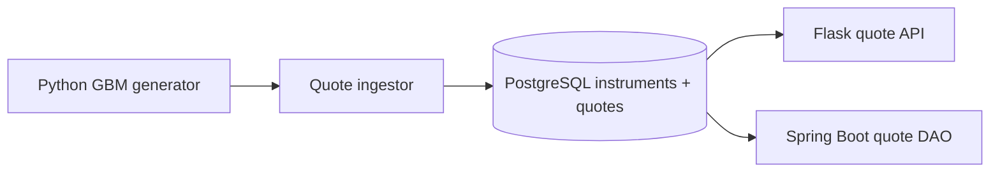

# NextTrade Offline Market Data Pipeline

## Purpose

This component generates reproducible synthetic US-equity quotes for
NextTrade environments that cannot access an external market-data API.

The generated quotes are intended for development, automated testing,
demonstration, and analytics. They are not live market data, investment
advice, or predictions of actual future prices.

## MVP Scope

The initial implementation supports:

- US common-stock symbols
- USD prices
- Whole-share market-order workflows
- Time-varying synthetic quotes
- Offline operation
- Reproducible results using a fixed random seed
- Geometric Brownian Motion as the synthetic price model

## Quote Contract

Each quote contains the following fields:

- `symbol`: Supported US-equity ticker
- `quote_timestamp`: UTC timestamp for the quote
- `price`: Synthetic reference price
- `bid`: Synthetic bid price
- `ask`: Synthetic ask price
- `currency`: Always `USD` in the MVP
- `source`: Always `SYNTHETIC_GBM`
- `synthetic`: Always `true`

## Example

```csv
symbol,quote_timestamp,price,bid,ask,currency,source,synthetic
AAPL,2026-09-08T14:30:00Z,225.4300,225.4100,225.4500,USD,SYNTHETIC_GBM,true


## PostgreSQL quote architecture

Current MVP scope is limited to synthetic US equities: AAPL, MSFT, NVDA, AMZN, and GOOGL. Older multi-asset wording does not represent current customer scope.



PostgreSQL is the durable shared quote source. Spring Boot reads it directly and does not call Flask on the execution-critical path. Field mapping is: `symbol` resolves `(NASDAQ, symbol)` to `instrument_id`; `quote_timestamp` becomes `quoted_at`; `bid`, `ask`, and `source` map directly; `synthetic` becomes `is_synthetic`; midpoint is derived from bid and ask.

One shot: `python -m src.quote_ingestor --once --periods 10 --seed 42`. Continuous: `python -m src.quote_ingestor --continuous`. Set `QUOTE_PROVIDER=csv` only for explicit local fallback. PostgreSQL failures never silently fall back to CSV.

The MVP retention policy deletes nothing automatically. Historical synthetic quotes are retained because future execution and audit work requires exact provenance. This branch does not execute orders, create fills, settle cash, or update holdings.
