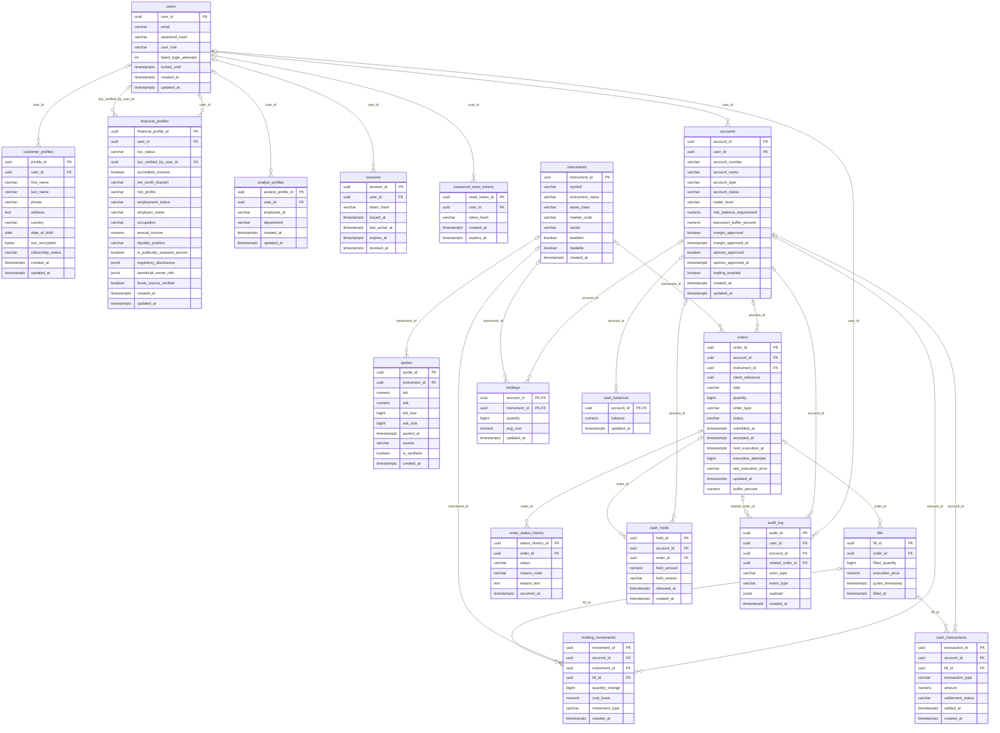

# Current database ERD

Generated by `python scripts/generate_erd.py` from `db/finalized-schema.sql`.

FK arrows identify references. Nullability, unique constraints and deletion behavior are defined in the SQL.
