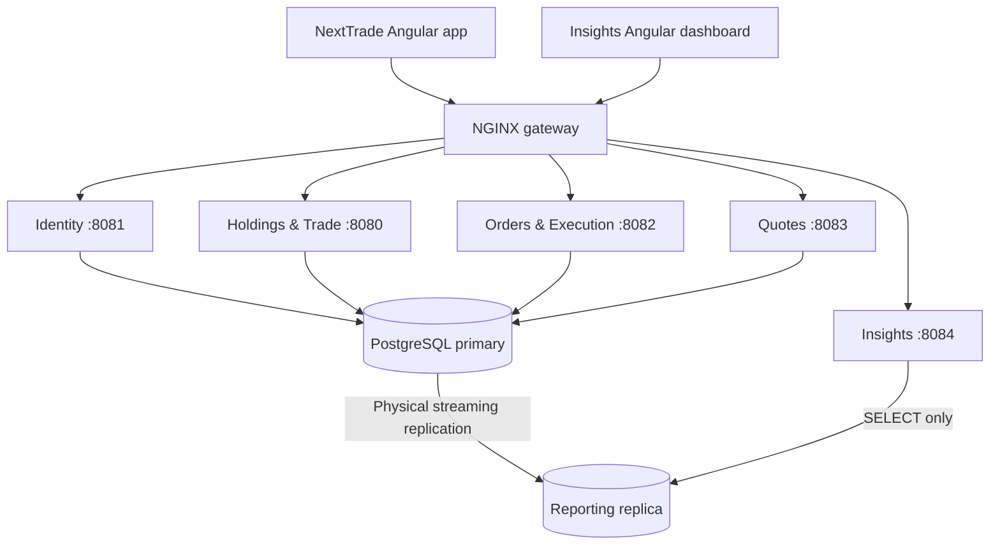

# Service boundaries and diagram alignment

The supplied System Architecture diagram is the target. Existing directory names
are retained so CI and Docker build contexts remain recognizable.

| Diagram component | Directory / Compose service | Internal port | Responsibility |
| --- | --- | --- | --- |
| Identity | `auth` / `auth` | 8081 | Registration, login, token issuance/rotation and identity policy |
| Holdings & Trade | `nextTrade-holdings` / `holdings` | 8080 | Accounts, cash, positions, order history and instrument-reference APIs |
| Order & Execution | `nextTrade-orders` / `orders` | 8082 | Submission, validation, acceptance, execution and atomic settlement |
| Quote Service | `data-pipeline` / `quote-service` | 8083 | Generate, persist and serve source-tagged synthetic quotes |
| Insights | `insights` / `insights` | 8084 | Analyst-only reporting queries against the reporting replica |
| API Gateway | `gateway` / `gateway` | 4200, 4201 | Same-origin routing and optional TLS termination for both clients |



## Ownership and data contracts

Insights does **not** invoke Orders or Holdings. It reads replicated holdings,
cash, order and fill data using a separate SELECT-only role. Reading an order row
for analytics does not give Insights responsibility for submitting or executing
orders. There is no `order` business package, trading controller or worker in
Insights. `GET /api/v1/reports/summary` is restricted to ANALYST tokens.

Holdings owns the public account/portfolio/reference read APIs. Orders uses small
local read contracts for account eligibility, instrument flags and stored quotes
to validate and settle trades against the shared primary. The instrument API
controller exists only in Holdings; Orders' instrument classes are validation
dependencies, not another catalog endpoint. Quote ingestion remains solely in
the Python service. The current execution quote contract is a JDBC query against
that service's persisted quotes; it is not an HTTP call or a second quote producer.

Identity retains provisioning of a trader's initial account in its registration
transaction. Portfolio access and order history belong to Holdings. Java services
verify Identity-issued tokens; the unused onboarding/user copies were removed.

Orders has one durable worker and one concrete transactional executor. A submitted
order is accepted in a committed transaction, claimed with `FOR UPDATE SKIP LOCKED`,
then executed in a separate transaction with an attempt-number fence. All fills,
cash/holding ledger entries, balance caches, terminal status and fill audit entries
commit together. The `holding_movements` trigger owns the holdings projection;
the executor updates the cash cache. A per-account lock prevents concurrent trades from spending the
same cash or shares. Acceptance does not reserve resources: execution rechecks
resources and may reject an accepted order.

New submissions record a `SUBMISSION_VALIDATED` history entry. Only those
SUBMITTED rows are automatically accepted. Legacy unmarked submissions stay
unchanged and need explicit revalidation before execution; the refactor does not
silently trade old unvalidated requests. Existing ACCEPTED/PENDING orders retain
their durable recovery behavior.

## Gateway routes

All service ports are internal to Compose. The client URLs remain
`http://localhost:4200` and `http://localhost:4201`.

| Client | Route | Owner |
| --- | --- | --- |
| Both | `/auth/*` | Identity |
| NextTrade | `/rules/*` | Identity |
| NextTrade | `POST /api/v1/orders` | Orders |
| NextTrade | `GET /api/v1/orders` | Holdings |
| NextTrade | `/api/v1/accounts`, `/holdings`, `/cash`, `/instruments` | Holdings (all use `/api/v1`) |
| NextTrade | `/api/v1/quotes/{symbol}` | Quotes |
| NextTrade | `/api/v1/quotes/latest/*`, `/api/v1/quotes/history/*` | Holdings display reads |
| NextTrade | `/api/v1/clients/{id}/holdings`, `/api/v1/clients/{id}/cash`, `/api/v1/cash/balance/{id}` | Holdings (caller-scoped) |
| NextTrade | `/api/v1/clients/{id}/orders?from=YYYY-MM-DD&to=YYYY-MM-DD&status=FILLED` | Holdings (TRADER-only, caller-scoped history and fills) |
| Insights | `/api/v1/reports/*` | Insights |

The reporting listener does not forward trading endpoints. Services also enforce
their own route and role restrictions, independently of NGINX. The front-end
containers serve static files only. For Angular development, run Compose and then
`npm start` in `frontend` (4300) or `insights-frontend` (4301); API requests proxy
through the same gateway. This avoids maintaining a second method-based router.

## Deployment and existing databases

For a new database:

```sh
docker compose up --build
```

For an existing database, preserve the `db_data` volume. Init scripts do not rerun
automatically. Stop settlement writers first (`docker compose stop orders`). Apply
the execution, holdings-projection and cash-detail migrations in order, then initialize
reporting roles and the replication slot **before** starting the replica:

```sh
docker compose up -d db
docker compose exec -T db psql -U main -d nexttrade -v ON_ERROR_STOP=1 < db/migrations/007_durable_order_execution.sql
docker compose exec -T db psql -U main -d nexttrade -v ON_ERROR_STOP=1 < db/migrations/008_holdings_projection.sql
docker compose exec -T db psql -U main -d nexttrade -v ON_ERROR_STOP=1 < db/migrations/009_cash_settlement_detail.sql
docker compose exec -T db bash /docker-entrypoint-initdb.d/04-reporting.sh
docker compose up --build -d
```

The input-redirection command is for a POSIX shell. In PowerShell use
`Get-Content db/migrations/007_durable_order_execution.sql | docker compose exec -T db psql -U main -d nexttrade -v ON_ERROR_STOP=1`,
then repeat with `008_holdings_projection.sql` and `009_cash_settlement_detail.sql`. Migration 008 rebuilds ledger-backed
positions and requires complete ledger history for those positions. Review opening
balances before applying it. Orders refuses startup without the enabled projection
trigger, preventing trades from leaving stale holdings after an incomplete upgrade.

Set `REPORTING_DB_PASSWORD` and `REPLICATION_PASSWORD` in `.env`. The reporting
role can select explicitly allowed financial tables and cannot read users,
sessions, password-reset tokens or customer profile tables. It also cannot write
if accidentally pointed at the primary. The standby itself rejects writes.
Replication uses its private passfile. The health check supplies the reporting
password only to its `psql` process; a container-wide `PGPASSWORD` would override
the replication password and can prevent startup. Bootstrap unsets inherited
`PGPASSWORD` defensively.

The replica bootstrap uses PostgreSQL's
[`pg_basebackup -R`](https://www.postgresql.org/docs/16/app-pgbasebackup.html)
and a physical replication slot. Replication is asynchronous, so analytics may
lag trading. See PostgreSQL's [hot standby documentation](https://www.postgresql.org/docs/16/hot-standby.html).
The slot retains at most 1 GB of WAL; if a prolonged outage invalidates it, an
operator must rebuild the reporting replica. Bootstrap refuses to overwrite a
partial or non-standby data directory. Primary data is never deleted automatically.

For TLS termination, supply certificate paths and use:

```sh
docker compose -f docker-compose.yml -f docker-compose.tls.yml up --build
```

Set `TLS_CERTIFICATE_PATH` and `TLS_PRIVATE_KEY_PATH`. Both client listeners then
use HTTPS on their existing ports. The default Compose configuration uses HTTP
for local development. No backend ports are published.

## Bugs corrected during consolidation

- Insights previously contained order submission and an enabled execution poller.
- Submission and execution lived in different services; SUBMITTED orders lacked
  a durable acceptance step and could remain unprocessed.
- The old batch executor internally called transactional methods, bypassing Spring
  transaction interception. It also lacked account-level locking and cache updates.
- The old JPA executor expected columns such as `instruments.name`, `market`,
  `is_active` and `fills.quote_id`, which do not exist in the shipped schema.
  The consolidated JDBC executor uses the actual schema.
- The old gateway sent generic trading API calls to Orders, including portfolio
  requests. Its legacy prefix rewrites could also discard `/api/v1`.
- Insights used the primary's write-enabled application role. It now uses the replica
  and a separate restricted role, and rejects write routes at the API layer.

## Remaining feature gaps and limitations

These are separate product requirements; moving folders does not implement them:

- The Insights dashboard still uses sample data from `insights-data.ts`; it needs
  an authenticated data-loading flow and agreed reporting contracts. The aggregate
  summary endpoint is real, but it is not wired into the demo charts.
- NextTrade's trading screens also simulate trading locally; their live network
  integration covers authentication and order history through Holdings. Connect order tickets, quotes and
  portfolio views to the gateway APIs in a dedicated frontend integration change.
- Identity has no password-reset API. Implement token expiry, single-use reset,
  email delivery and session revocation in `auth`; do not restore Java auth clones.
- Scheduled reports need cadence, recipients/storage, timezone, retry and retention
  requirements. No scheduler is claimed to exist.
- New trading accounts remain PENDING with trading disabled. Activation and funding
  workflows are needed before a newly registered account can trade. Do not bypass
  these controls or invent balances to make demonstrations pass.
- The external HTTP market-data provider shown in the diagram is currently an
  in-process synthetic generator in `data-pipeline`. A separate provider/HTTP
  adapter is needed if independent deployment is required.
- The existing `v_account_holdings` view computes average cost using signed execution
  prices, which gives incorrect remaining cost after profitable/loss-making sells.
  The live Holdings API reads the correctly maintained `holdings` cache instead.
  Ledger replay/cost-basis reporting needs a separate accounting design and migration.
- Primary services still share the existing `app_user` role. Insights is isolated;
  least-privilege primary roles and database row-level security remain future work.
  Client ownership is currently enforced in application queries.

## Verification

Run `mvn -B clean verify` in each Java service and `mvn javadoc:javadoc` for API docs.
Moved portfolio, catalog, submission and security tests run with their new owners.
`ReportingBoundaryTest` verifies analyst access and rejects trading endpoints.

`python scripts/test_gateway.py --nginx /path/to/nginx` exercises the shipped
NGINX routes with local stub services, including GET/POST order routing and client
route isolation. Run `docker compose config -q` for the deployment model.
Run `bash scripts/test_reporting_replica.sh` for bootstrap credential isolation,
restart and non-standby refusal checks using command stubs. With Docker available,
`bash scripts/auth-integration-test.sh` verifies real Identity tokens through both
gateway listeners, Holdings reads, Orders request validation and reporting roles.

`OrderLifecyclePostgresTest` uses the full production schema in a randomly named
test schema and covers acceptance, exactly-once settlement, sales, concurrent cash
checks, rollback and quote retries. Set `TEST_POSTGRES_URL`, `TEST_POSTGRES_USER`
and `TEST_POSTGRES_PASSWORD` for a disposable PostgreSQL database. The test role
needs schema/extension creation permission. Without those variables it is skipped.

Run `db/tests/008_reporting_read_only.sql` as the primary owner after initializing
reporting to verify that even a connection to the primary cannot write or read
credentials under the reporting role. Check `SELECT pg_is_in_recovery()` on the
replica and verify a primary insert becomes visible there.

Historical story documents and checked-in generated Javadocs predate this split.
This document and current source are authoritative; regenerate HTML with
`python scripts/generate_javadocs.py` when publishing updated documentation.

### Verification performed for this refactor

- Java: Orders 98 tests (including real PostgreSQL contracts), Holdings 26, Insights 26; all passed.
- Javadoc validation passed for all three Java services.
- NextTrade frontend: 76 tests; Insights frontend: 24 tests; both production builds passed.
- Identity: 88 tests and its production build passed. Three stale controller-test
  assertions were updated to include the already-supported JWT role argument.
- Quote API: 8 tests passed.
- Gateway: 15 live NGINX routing/isolation checks passed. Base and TLS Compose
  configurations parsed successfully with Docker Compose.
- Isolated native PostgreSQL primary/standby: streaming, read-only state, propagation
  of a primary insert, SELECT-only role and denied credential reads verified.
- Live Java services: submission, asynchronous execution, holdings/cash updates,
  replicated reporting and role/service boundaries verified over HTTP.

Local database verification used PostgreSQL 18; Compose pins PostgreSQL 16 and
the Jenkins integration stage provisions PostgreSQL 16. A Docker engine was not
available locally, so full container startup and the Jenkins stage were not run.
TLS configuration was validated, but no user certificate was supplied for a TLS
handshake test. Isolated test processes were stopped after verification.

### NEXT-193 follow-up validation (30 September 2026)

The original native replication check used trust authentication, which missed a
reporting-password override of the replication passfile. The Compose environment
and bootstrap now separate those credentials. A fresh native PostgreSQL 18 SCRAM
check reproduced the failure with the wrong inherited password, successfully ran
`pg_basebackup` using the replication passfile after removing it, and independently
authenticated the reporting role with its own password. The temporary primary
was stopped after the check.

All three bootstrap regression checks passed. Bash syntax, base/TLS Compose
configuration, and active Markdown local links/code fences were checked. Historical
runbooks are labelled as superseded. The updated Docker integration script has
been syntax-checked; its full container run still needs a Docker engine.

## Rebase reconciliation (30 September 2026)

Replayed commits had restored the pre-split Compose file, duplicate JPA submission
classes and an Insights quote controller whose dependencies had moved. The
reconciliation restores the gateway, reporting replica and restrictive service
routes. Cash aliases and authenticated latest/history quote display reads now
belong to Holdings; quote ingestion and the symbol feed remain in Python.

Order submissions accept exactly one of `symbol` or `instrumentId` and require
`clientReference`. Both use the same eligibility, sufficiency, idempotency and
durable execution checks. Incoming `PENDING` insertion without those checks is
not a second submission path. Initial accepted API responses remain SUBMITTED;
the worker transitions them durably.

The optional [Kafka override](../../docker-compose.kafka.yml) preserves the incoming
broker scaffolding without making it a trading dependency. No application event
producer or consumer is implemented. See [Kafka setup](../../kafka/README.md).

### Verification after the rebase reconciliation

- Orders: 104 tests passed, including eight real PostgreSQL lifecycle/upgrade checks;
  Holdings: 55 passed, including five PostgreSQL projection/migration tests;
  Insights: 26 passed. No Java tests skipped in these runs.
- Java builds and strict Javadoc generation passed for all three services.
- Identity: 88 tests and build passed. Trading UI: 78-test suite and build passed;
  the subsequent quote-client regression test also passed (three focused tests).
  Reporting UI: 24 tests and build passed. Python: all 72 tests passed.
- Live native PostgreSQL 18 and Java APIs: ID-based submission, worker settlement,
  holdings/cash reads, client cash aliases, quote latest/history reads, replicated
  analyst reports and role/service restrictions passed.
- NGINX: 21 routing/isolation checks passed. Replica bootstrap: three regression
  checks passed. Base, TLS and optional Kafka Compose models parsed successfully.
- Active Markdown links/fences and shell syntax passed. The atomic-settlement ADR
  is labelled as a historical design snapshot rather than current implementation.

Docker images, the Docker auth integration script, TLS handshakes, Kafka startup
and the edited Jenkins pipeline were not executed: this workstation has no Docker
engine. Native database checks use PostgreSQL 18; Compose/CI target PostgreSQL 16.
Previous product gaps remain. Temporary verification services/databases are stopped
when the checks finish. No commit or push is performed by this verification.

### PR #85 merge resolution

Merged the fetched `origin/main` at `c37acb0` into `feat/instrument` locally.
The 22 conflict paths mostly replayed the older JPA/Insights layout over the
NEXT-193 replacements. Retained the shared gateway, reporting replica, current
security rules and single JDBC execution path.

Preserved NEXT-117 as `GET /api/v1/clients/{id}/orders` in Holdings, including
combinable UTC date/status filters, fill details, trader-only access and caller
ownership. The repository uses JDBC with bound parameters. Preserved the incoming
cash-rounding/error-clearing behavior through the existing executor/worker and
added a real PostgreSQL half-cent buy/sell regression test.

Validation: Orders 105 tests, Holdings 72, Insights 26; all passed without skips.
Orders and Holdings strict Javadoc checks passed, as did all three Java builds,
23 NGINX route/isolation checks, active Markdown links/fences, and base/optional
Kafka Compose parsing. Full Docker startup and Jenkins were not run locally.
No frontend source changes were needed for this merge; the previously verified
quote-client fixes were retained. The resolved merge is staged for commit/push.

### PR #85 follow-up after main advanced

The previous resolution was committed and pushed as `49c15dd`. Main then advanced
to `1a2db95`, adding NEXT-118 history UI and another order-validation implementation.
The follow-up merge preserves the existing JDBC submission, eligibility, sufficiency
and execution path rather than restoring the retired JPA classes.

Both trading dashboards now load real history through
`GET /api/v1/clients/{id}/orders` on the gateway to Holdings. Status filters include
SUBMITTED, ACCEPTED and DELAYED alongside the older statuses. Invalid date ranges
clear the loading state and invalidate outstanding responses. Incoming security
test cases exercise the canonical controller and production security configuration,
including token reuse and idempotent retry responses.

The incoming optional Jenkins coverage archive setting is retained; Surefire also
preserves JaCoCo's agent arguments so coverage is still collected. Earlier deployment
and schema reports are explicitly marked historical.

Validation: Orders 108 tests and Holdings 72 tests passed without skips, including
nine and six native PostgreSQL tests respectively. Trading UI: 89 tests and production
build passed. Both Java builds, coverage generation, 23 NGINX routing/isolation
checks, base Compose parsing and active Markdown links/fences passed. Docker startup
and Jenkins execution remain unverified on this workstation.

### PR #85 follow-up for portfolio summaries and API docs

Main advanced to `3a0a090` after `8e9eb6a`. Portfolio summaries and their Swagger annotations now live in Holdings, with caller/account ownership, deterministic default-account selection, and one `/api/v1` prefix. Totals include settled and pending cash; holds affect available cash only. Missing valuation quotes return 503.

Migration 009 upgrades existing cash ledgers and preserves immediate settlement and the legacy balance view column. It also grants existing ledger readers SELECT on the new holds table. Apply it as schema owner with settlement writers paused before deploying. Fresh databases include the fields and table directly. Automated reservation/release and delayed settlement remain unimplemented.

Incoming lifecycle audit behavior uses the existing JDBC worker transactions and claim fencing. Retired JPA execution classes stay removed. Swagger is generated separately by Orders, Holdings and Insights; Java documentation is available on native service ports, while the base gateway deployment remains unchanged except for the Holdings portfolio route. Optional Kafka and the Jenkins workspace-space regression fix are retained.

Verification for this merge: Orders 109 tests, Holdings 83 and Insights 26 passed without skips, including PostgreSQL schema upgrade, ownership, settlement/audit and Swagger route checks. All three Java builds and strict Javadocs passed. Frontend verification passed 100 tests across the full suite and corrected six-test quote suite; its production build passed. Gateway: 25 checks; replica bootstrap: three checks, including workspace spaces. Base/optional Kafka Compose validation and active Markdown links/fences passed. Full Docker startup and Jenkins were not executed locally.
