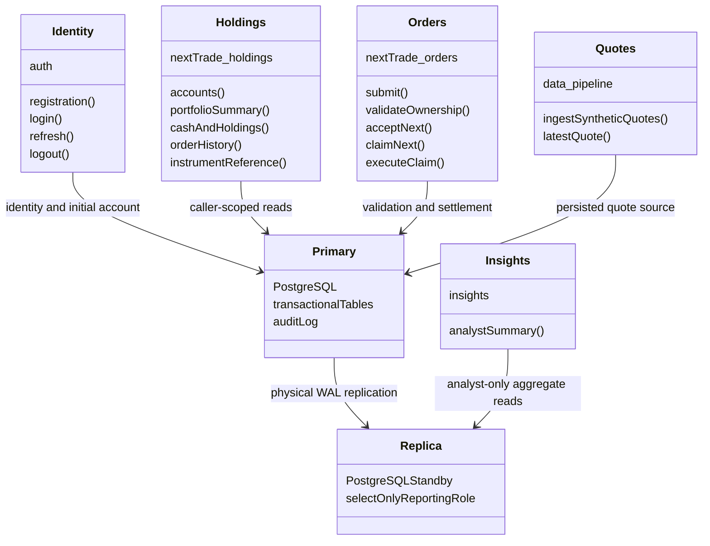

# Current service and order lifecycle UML

These diagrams describe the consolidated implementation. The supplied target
images are retained in [review/reference](../review/reference/); feature and
technology differences are recorded in the [alignment review](../review/architecture-alignment.md).

## Deployment and ownership



Service classes above are UML components represented as classes, not Java class
names. Java verifies Identity JWTs locally. Orders reads quote/account contracts
through JDBC; there is no synchronous Orders-to-Holdings or Orders-to-Quotes HTTP
hop. NGINX owns routing and contains no financial rules.

## Submission and settlement sequence

```mermaid
sequenceDiagram
  actor Trader
  participant Gateway as NGINX
  participant API as OrderSubmissionController
  participant Service as OrderSubmissionService
  participant Worker as OrderExecutionWorker
  participant Executor as JdbcOrderExecutor
  participant DB as PostgreSQL primary
  participant Replica as Reporting replica
  Trader->>Gateway: POST /api/v1/orders + Identity JWT
  Gateway->>API: Preserve method, path and authorization
  API->>Service: Validated SubmitOrderRequest + JWT subject
  Service->>DB: Ownership, eligibility, quote and sufficiency checks
  alt New clientReference
    Service->>DB: Commit SUBMITTED + SUBMISSION_VALIDATED history
    Service-->>Trader: 201 SUBMITTED
  else Same accepted request retry
    Service-->>Trader: 200 existing order
  end
  Worker->>DB: Commit acceptance
  Worker->>DB: Claim using SKIP LOCKED and increment attempt
  Worker->>Executor: Execute matching fenced claim
  Executor->>DB: Lock account; recheck quote and available resources
  alt Valid execution
    Executor->>DB: Atomic fill, ledger, cash cache, status and audit
    DB->>DB: Holdings movement trigger updates projection
  else Permanent rejection
    Executor->>DB: Commit REJECTED and audit
  else Transient quote failure
    Worker->>DB: Roll back effects; schedule retry
  end
  DB-->>Replica: Stream committed WAL
```

Source: `nextTrade-orders/src/main/java/com/neueda/leap/order/submission/`,
`nextTrade-orders/src/main/java/com/neueda/leap/order/execution/`, and
`db/finalized-schema.sql`. Acceptance does not reserve funds. Execution rechecks
cash/shares under the account lock. Cash-hold storage exists, but automated
reservation and delayed settlement are not implemented.
